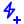
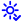

# Full Icon Catalog - Page 14

[<< Previous](ALL_ICONS_13.md) | Page 14 of 40 | [Next >>](ALL_ICONS_15.md)

| Name | Dark Mode | Light Mode | Red | Green | Blue | Orange | Pink | Gold | Yellow | Gray | Light Blue | Light Red | Light Green | Light Pink |
| :--- | :---: | :---: | :---: | :---: | :---: | :---: | :---: | :---: | :---: | :---: | :---: | :---: | :---: | :---: |
| `cloud-plus` |  |  |  |  |  |  |  |  |  |  |  |  |  |  |
| `cloud-x` |  |  |  |  |  |  |  |  |  |  |  |  |  |  |
| `cloud` |  |  |  |  |  |  |  |  |  |  |  |  |  |  |
| `git-branch` |  |  |  |  |  |  |  |  |  |  |  |  |  |  |
| `leaf` |  |  |  |  |  |  |  |  |  |  |  |  |  |  |
| `lightning-check` |  |  |  |  |  |  |  |  |  |  |  |  |  |  |
| `lightning-circle` |  |  |  |  |  |  |  |  |  |  |  |  |  |  |
| `lightning-minus` |  |  |  |  |  |  |  |  |  |  |  |  |  |  |
| `lightning-plus` |  |  |  |  |  |  |  |  |  |  |  |  |  |  |
| `lightning-x` |  |  |  |  |  |  |  |  |  |  |  |  |  |  |
| `lightning` |  |  |  |  |  |  |  |  |  |  |  |  |  |  |
| `moon-check` |  |  |  |  |  |  |  |  |  |  |  |  |  |  |
| `moon-circle` |  |  |  |  |  |  |  |  |  |  |  |  |  |  |
| `moon-minus` |  |  |  |  |  |  |  |  |  |  |  |  |  |  |
| `moon-plus` |  |  |  |  |  |  |  |  |  |  |  |  |  |  |
| `moon-x` |  |  |  |  |  |  |  |  |  |  |  |  |  |  |
| `moon` |  |  |  |  |  |  |  |  |  |  |  |  |  |  |
| `sun-check` |  |  |  |  |  |  |  |  |  |  |  |  |  |  |
| `sun-circle` |  |  |  |  |  |  |  |  |  |  |  |  |  |  |
| `sun-minus` |  |  |  |  |  |  |  |  |  |  |  |  |  |  |

[<< Previous](ALL_ICONS_13.md) | Page 14 of 40 | [Next >>](ALL_ICONS_15.md)
