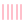

# Full Icon Catalog - Page 19

[<< Previous](ALL_ICONS_18.md) | Page 19 of 40 | [Next >>](ALL_ICONS_20.md)

| Name | Dark Mode | Light Mode | Red | Green | Blue | Orange | Pink | Gold | Yellow | Gray | Light Blue | Light Red | Light Green | Light Pink |
| :--- | :---: | :---: | :---: | :---: | :---: | :---: | :---: | :---: | :---: | :---: | :---: | :---: | :---: | :---: |
| `bar-chart-horizontal-big` |  |  |  |  |  |  |  |  |  |  |  |  |  |  |
| `bar-chart-horizontal` |  |  |  |  |  |  |  |  |  |  |  |  |  |  |
| `bar-chart` |  |  |  |  |  |  |  |  |  |  |  |  |  |  |
| `bar-chart2` |  |  |  |  |  |  |  |  |  |  |  |  |  |  |
| `bar-chart3` |  |  |  |  |  |  |  |  |  |  |  |  |  |  |
| `bar-chart4` |  |  |  |  |  |  |  |  |  |  |  |  |  |  |
| `barcode` |  |  |  |  |  |  |  |  |  |  |  |  |  |  |
| `barrel` |  |  |  |  |  |  |  |  |  |  |  |  |  |  |
| `baseline` |  |  |  |  |  |  |  |  |  |  |  |  |  |  |
| `bath` |  |  |  |  |  |  |  |  |  |  |  |  |  |  |
| `beaker` |  |  |  |  |  |  |  |  |  |  |  |  |  |  |
| `bean-off` |  |  |  |  |  |  |  |  |  |  |  |  |  |  |
| `bean` |  |  |  |  |  |  |  |  |  |  |  |  |  |  |
| `bed-double` |  |  |  |  |  |  |  |  |  |  |  |  |  |  |
| `bed-single` |  |  |  |  |  |  |  |  |  |  |  |  |  |  |
| `bed` |  |  |  |  |  |  |  |  |  |  |  |  |  |  |
| `beef-off` |  |  |  |  |  |  |  |  |  |  |  |  |  |  |
| `beef` |  |  |  |  |  |  |  |  |  |  |  |  |  |  |
| `beer-off` |  |  |  |  |  |  |  |  |  |  |  |  |  |  |
| `beer` |  |  |  |  |  |  |  |  |  |  |  |  |  |  |

[<< Previous](ALL_ICONS_18.md) | Page 19 of 40 | [Next >>](ALL_ICONS_20.md)
