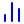
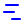

# Full Icon Catalog - Page 32

[<< Previous](ALL_ICONS_31.md) | Page 32 of 40 | [Next >>](ALL_ICONS_33.md)

| Name | Dark Mode | Light Mode | Red | Green | Blue | Orange | Pink | Gold | Yellow | Gray | Light Blue | Light Red | Light Green | Light Pink |
| :--- | :---: | :---: | :---: | :---: | :---: | :---: | :---: | :---: | :---: | :---: | :---: | :---: | :---: | :---: |
| `calendar-check2` |  |  |  |  |  |  |  |  |  |  |  |  |  |  |
| `calendar-clock` |  |  |  |  |  |  |  |  |  |  |  |  |  |  |
| `calendar-heart` |  |  |  |  |  |  |  |  |  |  |  |  |  |  |
| `calendar-minus` |  |  |  |  |  |  |  |  |  |  |  |  |  |  |
| `calendar-minus2` |  |  |  |  |  |  |  |  |  |  |  |  |  |  |
| `calendar-plus` |  |  |  |  |  |  |  |  |  |  |  |  |  |  |
| `calendar-plus2` |  |  |  |  |  |  |  |  |  |  |  |  |  |  |
| `calendar-search` |  |  |  |  |  |  |  |  |  |  |  |  |  |  |
| `calendar-x` |  |  |  |  |  |  |  |  |  |  |  |  |  |  |
| `calendar-x2` |  |  |  |  |  |  |  |  |  |  |  |  |  |  |
| `car-taxi-front` |  |  |  |  |  |  |  |  |  |  |  |  |  |  |
| `chart-no-axes-column-decreasing` |  |  |  |  |  |  |  |  |  |  |  |  |  |  |
| `chart-no-axes-column-increasing` |  |  |  |  |  |  |  |  |  |  |  |  |  |  |
| `chart-no-axes-column` |  |  |  |  |  |  |  |  |  |  |  |  |  |  |
| `chart-no-axes-combined` |  |  |  |  |  |  |  |  |  |  |  |  |  |  |
| `chart-no-axes-gantt` |  |  |  |  |  |  |  |  |  |  |  |  |  |  |
| `check-check` |  |  |  |  |  |  |  |  |  |  |  |  |  |  |
| `check-circle` |  |  |  |  |  |  |  |  |  |  |  |  |  |  |
| `check-circle2` |  |  |  |  |  |  |  |  |  |  |  |  |  |  |
| `check-line` |  |  |  |  |  |  |  |  |  |  |  |  |  |  |

[<< Previous](ALL_ICONS_31.md) | Page 32 of 40 | [Next >>](ALL_ICONS_33.md)
