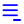
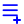
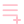

# Full Icon Catalog - Page 37

[<< Previous](ALL_ICONS_36.md) | Page 37 of 40 | [Next >>](ALL_ICONS_38.md)

| Name | Dark Mode | Light Mode | Red | Green | Blue | Orange | Pink | Gold | Yellow | Gray | Light Blue | Light Red | Light Green | Light Pink |
| :--- | :---: | :---: | :---: | :---: | :---: | :---: | :---: | :---: | :---: | :---: | :---: | :---: | :---: | :---: |
| `link-check` |  |  |  |  |  |  |  |  |  |  |  |  |  |  |
| `link-circle` |  |  |  |  |  |  |  |  |  |  |  |  |  |  |
| `link-minus` |  |  |  |  |  |  |  |  |  |  |  |  |  |  |
| `link-plus` |  |  |  |  |  |  |  |  |  |  |  |  |  |  |
| `link-x` |  |  |  |  |  |  |  |  |  |  |  |  |  |  |
| `link` |  |  |  |  |  |  |  |  |  |  |  |  |  |  |
| `lock-check` |  |  |  |  |  |  |  |  |  |  |  |  |  |  |
| `lock-circle` |  |  |  |  |  |  |  |  |  |  |  |  |  |  |
| `lock-minus` |  |  |  |  |  |  |  |  |  |  |  |  |  |  |
| `lock-plus` |  |  |  |  |  |  |  |  |  |  |  |  |  |  |
| `lock-x` |  |  |  |  |  |  |  |  |  |  |  |  |  |  |
| `lock` |  |  |  |  |  |  |  |  |  |  |  |  |  |  |
| `map-check` |  |  |  |  |  |  |  |  |  |  |  |  |  |  |
| `map-minus` |  |  |  |  |  |  |  |  |  |  |  |  |  |  |
| `map-plus` |  |  |  |  |  |  |  |  |  |  |  |  |  |  |
| `map-x` |  |  |  |  |  |  |  |  |  |  |  |  |  |  |
| `menu-check` |  |  |  |  |  |  |  |  |  |  |  |  |  |  |
| `menu-circle` |  |  |  |  |  |  |  |  |  |  |  |  |  |  |
| `menu-minus` |  |  |  |  |  |  |  |  |  |  |  |  |  |  |
| `menu-plus` |  |  |  |  |  |  |  |  |  |  |  |  |  |  |

[<< Previous](ALL_ICONS_36.md) | Page 37 of 40 | [Next >>](ALL_ICONS_38.md)
