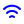

# Full Icon Catalog - Page 40

[<< Previous](ALL_ICONS_39.md) | Page 40 of 40

| Name | Dark Mode | Light Mode | Red | Green | Blue | Orange | Pink | Gold | Yellow | Gray | Light Blue | Light Red | Light Green | Light Pink |
| :--- | :---: | :---: | :---: | :---: | :---: | :---: | :---: | :---: | :---: | :---: | :---: | :---: | :---: | :---: |
| `trash-minus` |  |  |  |  |  |  |  |  |  |  |  |  |  |  |
| `trash-plus` |  |  |  |  |  |  |  |  |  |  |  |  |  |  |
| `trash-x` |  |  |  |  |  |  |  |  |  |  |  |  |  |  |
| `trash` |  |  |  |  |  |  |  |  |  |  |  |  |  |  |
| `unlock-check` |  |  |  |  |  |  |  |  |  |  |  |  |  |  |
| `unlock-circle` |  |  |  |  |  |  |  |  |  |  |  |  |  |  |
| `unlock-minus` |  |  |  |  |  |  |  |  |  |  |  |  |  |  |
| `unlock-plus` |  |  |  |  |  |  |  |  |  |  |  |  |  |  |
| `unlock-x` |  |  |  |  |  |  |  |  |  |  |  |  |  |  |
| `unlock` |  |  |  |  |  |  |  |  |  |  |  |  |  |  |
| `wifi-check` |  |  |  |  |  |  |  |  |  |  |  |  |  |  |
| `wifi-circle` |  |  |  |  |  |  |  |  |  |  |  |  |  |  |
| `wifi-minus` |  |  |  |  |  |  |  |  |  |  |  |  |  |  |
| `wifi-plus` |  |  |  |  |  |  |  |  |  |  |  |  |  |  |
| `wifi-x` |  |  |  |  |  |  |  |  |  |  |  |  |  |  |
| `wifi` |  |  |  |  |  |  |  |  |  |  |  |  |  |  |

[<< Previous](ALL_ICONS_39.md) | Page 40 of 40
