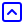

# Full Icon Catalog - Page 5

[<< Previous](ALL_ICONS_4.md) | Page 5 of 40 | [Next >>](ALL_ICONS_6.md)

| Name | Dark Mode | Light Mode | Red | Green | Blue | Orange | Pink | Gold | Yellow | Gray | Light Blue | Light Red | Light Green | Light Pink |
| :--- | :---: | :---: | :---: | :---: | :---: | :---: | :---: | :---: | :---: | :---: | :---: | :---: | :---: | :---: |
| `arrows-up-from-line` |  |  |  |  |  |  |  |  |  |  |  |  |  |  |
| `banknote-arrow-down` |  |  |  |  |  |  |  |  |  |  |  |  |  |  |
| `banknote-arrow-up` |  |  |  |  |  |  |  |  |  |  |  |  |  |  |
| `bow-arrow` |  |  |  |  |  |  |  |  |  |  |  |  |  |  |
| `calendar-arrow-down` |  |  |  |  |  |  |  |  |  |  |  |  |  |  |
| `calendar-arrow-up` |  |  |  |  |  |  |  |  |  |  |  |  |  |  |
| `chevron-down-circle` |  |  |  |  |  |  |  |  |  |  |  |  |  |  |
| `chevron-down-square` |  |  |  |  |  |  |  |  |  |  |  |  |  |  |
| `chevron-down` |  |  |  |  |  |  |  |  |  |  |  |  |  |  |
| `chevron-first` |  |  |  |  |  |  |  |  |  |  |  |  |  |  |
| `chevron-last` |  |  |  |  |  |  |  |  |  |  |  |  |  |  |
| `chevron-left-circle` |  |  |  |  |  |  |  |  |  |  |  |  |  |  |
| `chevron-left-square` |  |  |  |  |  |  |  |  |  |  |  |  |  |  |
| `chevron-left` |  |  |  |  |  |  |  |  |  |  |  |  |  |  |
| `chevron-right-circle` |  |  |  |  |  |  |  |  |  |  |  |  |  |  |
| `chevron-right-square` |  |  |  |  |  |  |  |  |  |  |  |  |  |  |
| `chevron-right` |  |  |  |  |  |  |  |  |  |  |  |  |  |  |
| `chevron-up-circle` |  |  |  |  |  |  |  |  |  |  |  |  |  |  |
| `chevron-up-square` |  |  |  |  |  |  |  |  |  |  |  |  |  |  |
| `chevron-up` |  |  |  |  |  |  |  |  |  |  |  |  |  |  |

[<< Previous](ALL_ICONS_4.md) | Page 5 of 40 | [Next >>](ALL_ICONS_6.md)
